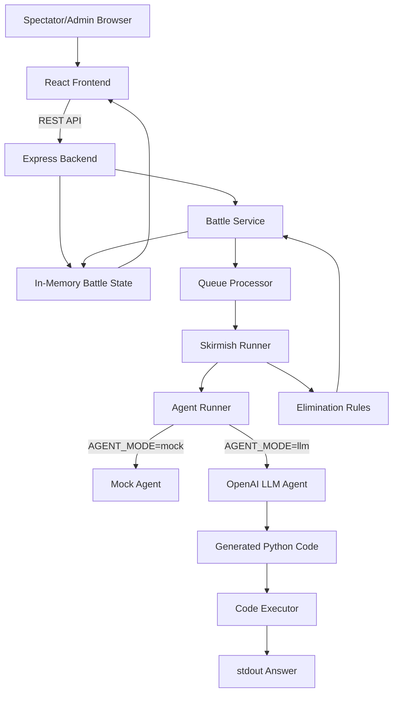

# AI Coding Agent Battle Royale

A browser-based spectator game where humans submit programming challenges and AI coding agents compete to solve them.

Spectators submit challenges with known answers. Admins configure AI competitors, including which OpenAI model each competitor uses. Competitors race in skirmishes by generating and executing code, and are eliminated based on correctness and speed until one winner remains.

## Live Demo

* Frontend: `https://ai-battle-royal-frontend-production.up.railway.app/`
* Backend health check: `https://ai-battle-royal-production.up.railway.app/api/health`
* Admin username: `admin`
* Admin password: `dev-admin-password`

## Features

* Single global battle arena
* Spectator login with username only
* Single admin login with password-protected controls
* Admin can configure custom competitors
* Each competitor can use a different OpenAI model
* Competitor cards display the model used
* Spectators can submit programming challenges with expected answers
* Skirmishes select 2-4 alive competitors
* Agents race concurrently within a skirmish
* Only one skirmish runs at a time
* Mock agent mode for reliable demos
* LLM agent mode using OpenAI
* Generated Python execution with timeout/output limits
* Event log and skirmish history
* Winner detection when one competitor remains

## Tech Stack

### Frontend

* Vite
* React
* TypeScript
* Polling via `GET /api/state`
* Railway deployment

### Backend

* Node.js
* Express
* TypeScript
* In-memory battle state
* OpenAI SDK
* Python subprocess execution for generated code
* Railway deployment as a long-running backend service

## Architecture



## Gameplay

1. Admin logs in.
2. Admin creates 2-24 competitors.
3. For each competitor, admin chooses:

   * name
   * OpenAI model
4. Admin starts the battle.
5. Spectators submit programming challenges with expected answers.
6. Each challenge triggers a skirmish between 2-4 alive competitors.
7. Agents generate and execute code to produce an answer.
8. Incorrect, timed-out, or errored competitors are eliminated.
9. If all agents answer correctly, the slowest competitor is eliminated.
10. If all selected agents would be eliminated, the skirmish is canceled and nobody is eliminated.
11. The last remaining competitor wins.

## Example Challenges

```txt
Question:
What is 123456789 * 987654321?

Expected answer:
121932631112635269
```

```txt
Question:
What is 7^77 mod 999999937?

Expected answer:
860842589
```

```txt
Question:
What is the sum of the ASCII values of every character in "The quick brown fox jumps over the lazy dog"?

Expected answer:
4057
```

## Agent Modes

### Mock Mode

```env
AGENT_MODE=mock
```

Mock mode simulates agents that sometimes answer correctly, answer incorrectly, timeout, or error.

This is the safest mode for demos because it does not depend on OpenAI or Python availability.

### LLM Mode

```env
AGENT_MODE=llm
```

LLM mode uses OpenAI to generate Python code for each competitor.

Each competitor uses the model selected by the admin during battle configuration.

The generated code is executed by the backend, and `stdout.trim()` is used as the submitted answer.

## Environment Variables

### Backend

Set these in `apps/server/.env` locally and on the Railway backend service.

```env
NODE_ENV=production
PORT=3000

# Admin
ADMIN_PASSWORD=dev-admin-password

# Agent mode
AGENT_MODE=mock

# OpenAI
OPENAI_API_KEY=
OPENAI_MODEL=gpt-4.1-mini

# Comma-separated list shown in the admin model dropdown
OPENAI_MODELS=gpt-4.1-mini,gpt-4.1,gpt-4o-mini,gpt-4o

# Skirmish/execution limits
SKIRMISH_TIMEOUT_MS=60000
CODE_TIMEOUT_MS=3000
MAX_OUTPUT_BYTES=4096
MAX_GENERATED_CODE_CHARS=12000

# Python command
# Windows local dev may use: py
# Railway/Linux usually uses: python3
PYTHON_COMMAND=python3
```

### Frontend

Set these in `apps/client/.env` locally and on the Railway frontend service.

```env
VITE_API_BASE_URL=http://localhost:3000
VITE_ADMIN_USERNAME=admin
```

For deployment:

```env
VITE_API_BASE_URL=https://ai-battle-royal-production.up.railway.app
VITE_ADMIN_USERNAME=admin
```

Vite environment variables are build-time values, so redeploy the frontend after changing them.

## Running Locally

### Install dependencies

```bash
cd apps/server
npm install

cd ../client
npm install
```

### Start backend

```bash
cd apps/server
npm run dev
```

Backend runs at:

```txt
http://localhost:3000
```

Health check:

```txt
http://localhost:3000/api/health
```

### Start frontend

```bash
cd apps/client
npm run dev
```

Frontend runs at:

```txt
http://localhost:5173
```

## API Overview

### Public Routes

```txt
GET  /api/health
GET  /api/state
GET  /api/models
POST /api/challenges
```

### Admin Routes

Admin routes require:

```txt
x-admin-password: dev-admin-password
```

```txt
POST /api/admin/config
POST /api/admin/start
POST /api/admin/reset
POST /api/admin/clear-queue
```

## Railway Deployment

The app is deployed as two Railway services from the same monorepo.

### Backend Service

```txt
Root Directory: apps/server
Build Command: npm run build
Start Command: npm start
```

Expected backend start script:

```json
{
  "scripts": {
    "build": "tsc",
    "start": "node dist/index.js"
  }
}
```

Backend health check:

```txt
https://ai-battle-royal-production.up.railway.app/api/health
```

### Frontend Service

```txt
Root Directory: apps/client
Build Command: npm run build
Start Command: npm run preview -- --host 0.0.0.0 --port $PORT
```

Expected frontend scripts:

```json
{
  "scripts": {
    "build": "tsc -b && vite build",
    "preview": "vite preview"
  }
}
```

## MVP Tradeoffs

### In-Memory State

Battle state is stored in the backend process memory.

This keeps the project simple and avoids database setup for the MVP.

Implications:

* Closing a browser tab does not reset the battle.
* Multiple spectators see the same global battle.
* Backend restart/redeploy clears active battle state.
* Match history is not durable.

### Polling Instead of WebSockets

The frontend polls `GET /api/state`.

This is simpler and more reliable for the MVP. A production version would likely use WebSockets or Server-Sent Events.

### One Battle at a Time

The MVP supports one global battle arena.

Multiple users can spectate and submit challenges, but they all interact with the same active battle.

### Simplified Code Execution

LLM-generated code is executed with:

* timeout limits
* output limits
* generated code length limits
* no secret environment variables passed to the child process

This is not production-grade sandboxing.

A production system should run generated code inside a stronger isolation boundary such as containers or microVMs with CPU, memory, filesystem, and network restrictions.

## Future Improvements

* Durable battle history
* Match replay
* Multiple battle rooms
* WebSocket/SSE live updates
* Stronger code execution sandbox
* Better agent personalities
* More detailed agent reasoning visualization
* Challenge validation/moderation
* Real user accounts
* Leaderboards
* Dockerized backend with guaranteed Python support for deployed LLM mode

## Notes

The core architecture is intentionally simple:

* Express routes handle HTTP.
* `battleService` owns game state transitions.
* `skirmishRunner` runs selected competitors.
* `agentRunner` chooses mock or LLM mode.
* `llmAgent` calls OpenAI using the competitor’s selected model.
* `codeExecutor` runs generated Python.
* `rules.ts` decides eliminations.
* React polls `/api/state` and renders the current battle.

